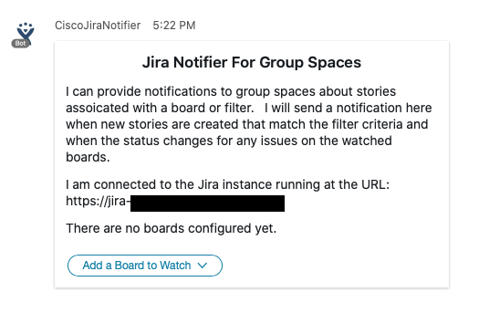
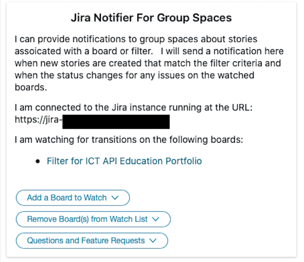

# webex-jira-notifier module for group spaces

The bot may be configurated to work in group spaces by setting the following environment variables:

- ENABLE_GROUP_NOTIFICATIONS - set this to true (or "true") to enable the module
- DEFAULT_DOMAIN - set this to a comma seperated list of the email domain(s) of your jira users

For security, the bot will not operate in spaces where any user does not have an email in the DEFAULT_DOMAIN list.

## Working in group spaces

While the jira notifier will look for notifications related to a specific user in a 1-1 space, it will look for issues related to certain boards or filters in group spaces.  Upon entering a space (or after being mentioned with almost any text)the bot will present a card, allowing users in the space to configure which boards or filters it should watch:

Users in the space can choose "Add a Board to Watch" to configure a board or filter.   In general jira "rapid boards" and can be entered via a URL or boardId.  There is limited API access for nearly every other type of board (or for rapid boards with specific quick filters active), so when users want to be notified about changes on these boards it is reccomended that they specify the appropriate filter.

The bot supports up to 3 boards or filters per space.   Each time a board or filter is added or removed, a card with the current configuration is show.

## How it works

Once a board or filter is specified, the bot will attempt to look up the details of the board and find all the issues that match the filter.  The keys to these stories are stored in a cache and whenever a status for one of these stories changes, the bot will send a notification to the space.

When new issues are created, it is tested against each of the watched filters and added to the story cache as appropriate.  

There are ways that the bots story cache can diverge from the jira system. For example, a story could be modified in such a way that it no longer matches a cached filter.  However it would be to expensive to check this for every jira issue modified event, so it is possible that the bot can miss status changes on stories that were recently changed in order to fit a filter's criteria, and then had their status change.   Its also possible that the search criteria for a filter could change making the story cache out of date.

By default, the cache is refreshed every 6 hours.   This can be customized by setting the BOARD_STORY_CACHE_TIMEOUT to the number of milliseconds between cache refreshes.
